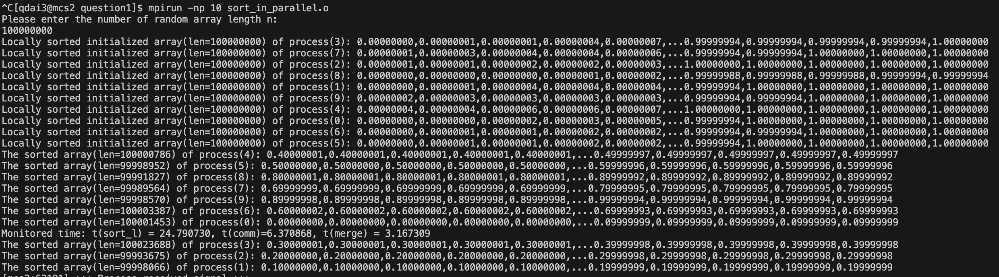
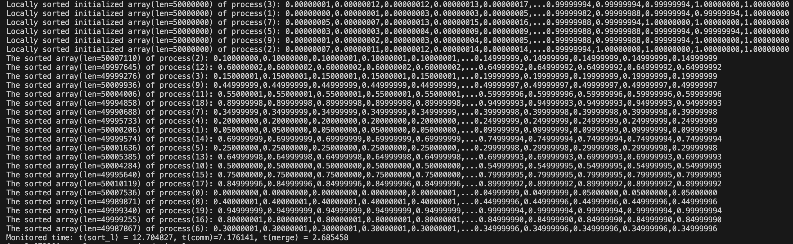

## Question 1
Write a parallel MPI program which generates a sequence of N random numbers, each between 0 and 1, on each of its p processes.

Then implement a sorting algorithm where each process sorts the sequence of numbers it has, then distributes parts of it to the other processes so that at the end process 0 has the random numbers between 0 and 1/p, process 1 has numbers between 1/p and 2/p, and so on until the last process has numbers between (p-1)/p and 1

## Logic
### framework of program
The overall framework of the program can be as simple as following:
1. Initialize the sequence of floating numbers and sort within process
2. Distribute numbers to corresponding processes according to the requirement
3. Merge distributed number from different processes and print the result
### key code segment
There are major challenges I encountered or trickes i used in coding
* utilized the merchanism of asynchronized communication: `MPI_Isend` and `MPI_Irecv`
I tried to use `MPI_Waitany` to maximize concurrency without waiting for recieving next process. However, it doesn't work well, so I change back to `MPI_Waitall` and found the communicate between processes is very fast partly due to limited number of processes.
* use merge to maximize performance on sorted data(will analyze in detial in next section)
* Print gracefully
To print gracefully, the program only print first and last few float numbers for large number of N. One easy to neglect details is that c program don't initialize string during delaration, so that it should be intialized with a simple line of code `result[0] = '\0'`， which took me some time to find out this bug that only appeared on large number of N. 

## Performance analysis
### Theoratical Calculation 
The overall time can be devided into(excluding num_array initialziation and misc thing, such as printing):
| Time | Description | Complexity |
| -------- | ------- | -------- |
| T(sort_local) | Sort(quick sort) of num_array in each process | O(n*log(n)) |
| T(comm) | Inter-process communication | O(n * p) ** |
| T(merge) | Merge portion of sorted num_array from different processes | O(n*p*(3/2)) |
** For asynchronize communicaiton, it is hard to estimate the communication speed, just using synchronized communication as simulation.

To make the parallelism worthwile, according to "Isoefficiency function(`𝑁 = 𝐾𝑇𝑜(𝑁 , 𝑝)`)",
`Ts = n*p*log(n*p)*T(sort)`
`Tp = n*log(n)*T(sort) + n*p*T(comm) + n*p*(3/2)T(sort)`
.where `T(sort)` is the unit time for sort and `T(comm)` is the time for single communication

To archieve different level of efficienty(use spead-up ratio for easy to understand), N need to be big enough as described in a table as follows, where `S=Ts/Tp`, and `log2(n) = (T(comm)/T(sort)+3*S/2-log2(p))/(1-S/p)`:
| S\P | P=10 | P=20 | P=40 |
| -------- | ------- | -------- | ------- |
| S=8 |  N=2^30 | N= 2^8.6 | N= 2^5.2 |
| S=16 | N/A | N= 2^26| N= 2^6.9 |
| S= 32 | N/A | N/A | N= 2^20.9 |
let T(comm)/T(sort) = 8

### Lab Experiment on Server
#### P=10

#### P=20

#### P=40

### Lab Experiment on Server
After lab experiment, we can found the communication time rises with more processes involved in the calculation.