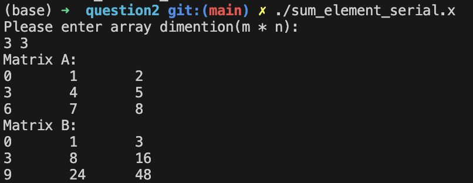

## Question 2
We have two dimensional array A, with indices (ip,jp)
We want to compute an array B, were element B(i,j) is the sum of all elements in A for which ip is less than or equal to i and jp is less than or equal to j.

1. Write a serial program to do this.
2. Re-write program from step 1 as a parallel OpenMP program which uses tasks.  Have one task to compute each entry of array B.  Use normal loops to launch the tasks, with appropriate dependencies to ensure they execute in the correct order.
3. Having only one array entry per task will not be efficient.  Adapt the program from step 2 so that it groups elements of the array into blocks, and then assign each block to one task.  
4. Analyze and compare the performance of the three codes as the array size increases.

## Logic 
### framework of program
#### key code segment
As explained in class, the tricky part is that it can be used constructed in a recursive form. 
Element in matrix B can be calculated from "nearest box"

#### How to parallelize the code
* task per entry
Simliar to fabonacci sequence by recursion, such probelm can be viewed as 2D fabonacci sequence

* task per block
Haven't figured out how to do that. 

## Performance analysis
### serial vs task

### task vs block
it is more challenging to be finished tonight